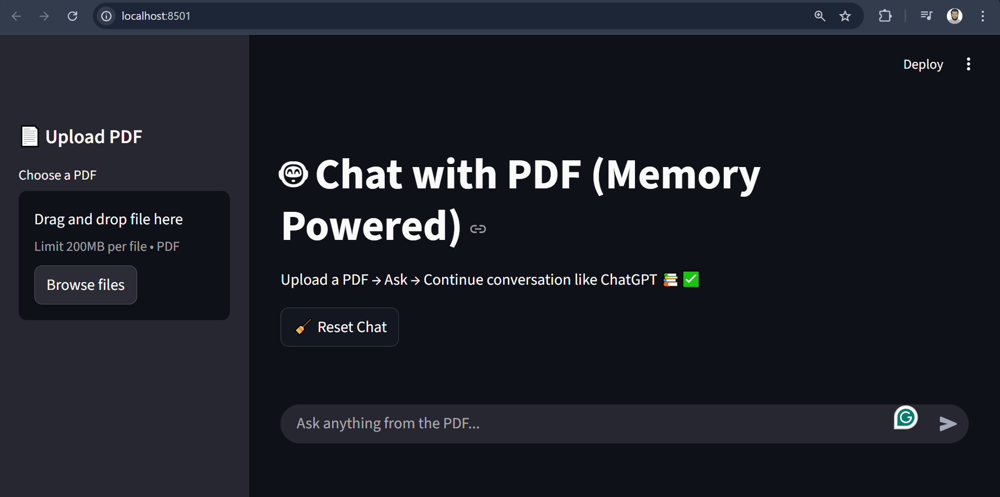
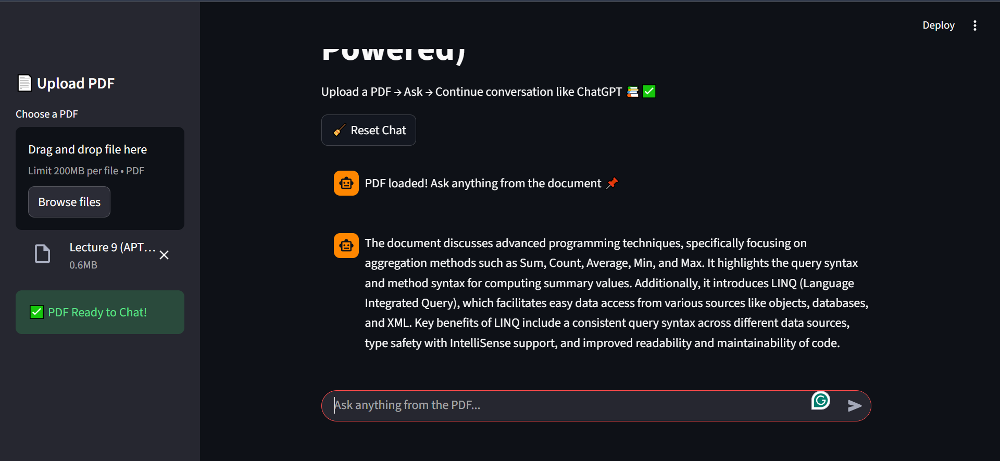

# 📘 PDF-RAG App

A lightweight Retrieval-Augmented Generation (RAG) application in Python.  
Upload a PDF → the app extracts text → builds vector embeddings → and answers questions about the document using an LLM.

---

## 🚀 Highlights
- Upload and process PDF files (PyPDF2)  
- Create embeddings and store vectors (FAISS / OpenAI embeddings)  
- Retrieval-augmented answers (contextual responses limited to PDF content)  
- Simple Streamlit UI and local chat memory (`chat_history.json`)  
- Safe: keep API keys in `.env` (never commit secrets)


---

## 📸 Screenshots

> Screenshots are loaded from the repository root.





---

## ⚙️ Setup (Windows)

1. Create & activate a virtual environment:
```powershell
python -m venv venv
venv\Scripts\activate
Install dependencies:

powershell
Copy code
pip install -r requirements.txt
Add your API key to .env:

ini
Copy code
OPENAI_API_KEY=your_api_key_here
Important: Add .env to .gitignore to avoid committing secrets.

Run the app:

powershell
Copy code
python app.py
Open the URL printed by Streamlit (usually http://localhost:8501) in your browser.

🧠 How it Works
PDF upload → pages extracted by PyPDF2

Text chunking → text is split into manageable chunks

Embeddings → generated using OpenAI embeddings

Vector store (FAISS) → stores and retrieves relevant chunks

LLM prompt → generates answers using only retrieved context

Chat history → saved locally in chat_history.json

✅ Recommendations & Notes
Never commit credentials — keep .env local and add to .gitignore:

bash
Copy code
# .gitignore
.env
chat_history.json
__pycache__/
*.pyc
If you use real keys and accidentally commit them, rotate immediately.

For public deployment, consider server-side token management to avoid exposing keys.

🧩 requirements.txt (example)
text
Copy code
streamlit
python-dotenv
PyPDF2
faiss-cpu
langchain-community
langchain-openai
🤝 Contributing
PRs and issues are welcome.
Please document new features (chunking, caching, multi-file upload, search UI) in the README.

📜 License
MIT License — feel free to reuse or improve.

ℹ Contact
If you want, I can also add:

GitHub badges (Python, License, Stars)

Architecture diagram

Demo GIF

.env.example template for safer sharing

yaml
Copy code

---

This version:  
✅ Shows your **screenshots properly** from the repo  
✅ Fixes all formatting issues (headings, code blocks, lists)  
✅ Explains setup, usage, workflow clearly  
✅ Safe for GitHub upload (without `.env`)  

---

If you want, I can also **create a `.env.example` version** and `.gitignore` ready for GitHub so others can run the project safely without exposing keys.  

Do you want me to do that next?


